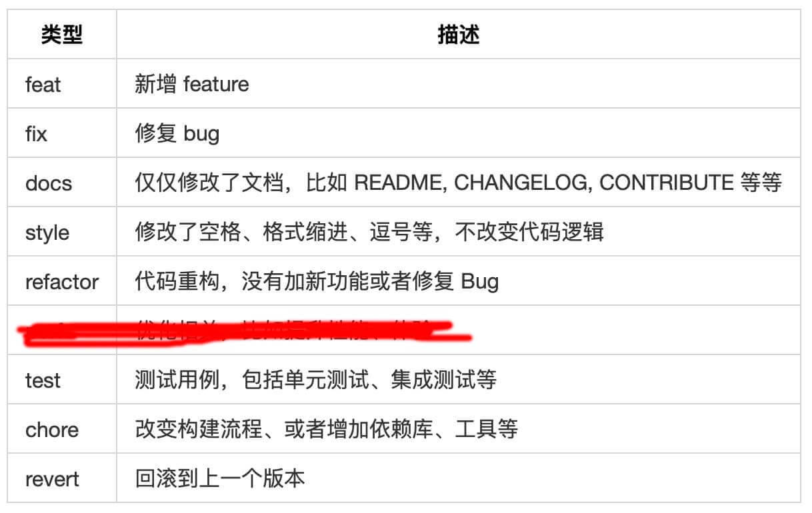

# 前端开发规范整理

## 1. 阿里前端开发规范
  [文档下载](阿里前端开发规范.pdf)

## 2. Git代码提交规范
### 提交comment格式
    提交类型: 内容

    例: 
    feat: 登录功能
    fix: 修复登录bug 

### 提交类型

## 3. 阿里f2elint配套工具使用
    
    F2ELint是《阿里巴巴前端规约》的配套 Lint 工具，可以为项目一键接入规约、一键扫描和修复规约问题，保障项目的编码规范和代码质量。
   [官方文档](https://www.npmjs.com/package/f2elint)
